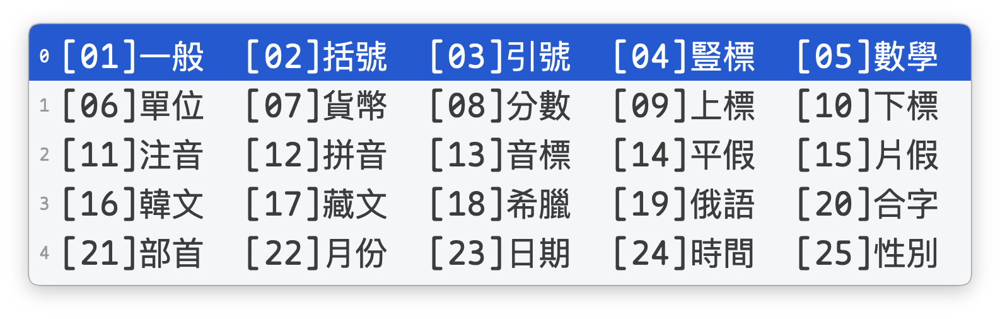
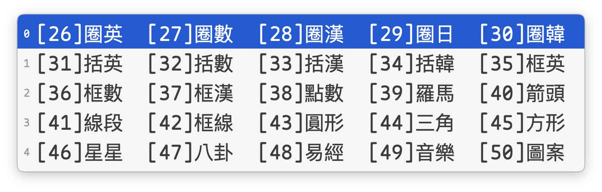
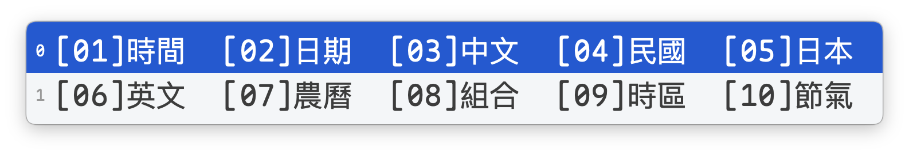
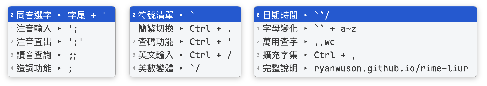

# 蝦米輸入方案功能說明

---

## 一、基本輸入

### 蝦米字碼及英文混合輸入

- 直接輸入蝦米字碼，按下 `Space` 或數字鍵，即可選字上屏
- 如果輸入的是 `www.google.com` ，按下 `Enter`，即可將英文上屏


### 英文輸入模式

- **快捷鍵**：`Ctrl + /`
- **說明**：切換至英文輸入模式，內建豐富詞組，輸入完成按 `Space` 上屏


---

## 二、造詞功能

### 臨時造詞

臨時造詞適合日常使用，造詞後可立即使用，系統會自動儲存。

#### 造詞操作方式

1. 輸入 `;` 進入造詞模式（顯示《造詞》▸）
2. 依序輸入每個字的編碼，用 `` ` `` 分隔
3. 按空白鍵確認上屏

#### 刪除臨時造詞

打出造詞後，游標移到該詞條，按 `Ctrl + K`（macOS 為 `Fn + Shift + Delete`）即可刪除。

#### 使用範例

- **造「臺北車站」**：``;te`ffl`cj`lzo`` → 臺北車站
- **造「行政院」**：``;mv`ezp`br`` → 行政院


#### 臨時造詞編碼規則

造詞後會自動產生 4 碼的快捷編碼，取每個字的「首碼」組合：

| 詞長 | 編碼規則 | 說明 |
|:----:|:--------:|:-----|
| 2 字詞 | ABBB | 第1字首碼 + 第2字首碼×3 |
| 3 字詞 | ABCC | 第1字首碼 + 第2字首碼 + 第3字首碼×2 |
| 4字以上 | ABCZ | 第1字首碼 + 第2字首碼 + 第3字首碼 + 末字首碼 |

#### 編碼範例

| 詞彙 | 各字首碼 | 造詞編碼 |
|:----:|:---------|:--------:|
| 台北 | 台(u) 北(f) | `ufff` |
| 行政院 | 行(m) 政(e) 院(b) | `mebb` |
| 台北市政府 | 台(u) 北(f) 市(l) 政(e) 府(l) | `ufll` |

#### 儲存位置

臨時造詞會自動儲存在使用者詞庫中：

| 平台 | 儲存位置 |
|:----:|:---------|
| macOS | `~/Library/Rime/liur.userdb/` |
| Windows | `%AppData%\Rime\liur.userdb\` |

#### 注意事項

- 造詞後可立即使用，不需重新部署
- 關閉輸入法時會自動保存
- 分享方案給他人時，不要包含 `liur.userdb/` 資料夾（避免洩漏個人造詞）

### 直接編輯造詞

如需批量新增詞彙或與他人分享自訂詞庫，可直接編輯詞庫檔案。

#### 操作步驟

1. 開啟自訂詞庫檔案 `openxiami_CustomWord.dict.yaml`
2. 在檔案中新增詞條（格式：`詞彙<Tab>編碼`），不受限於臨時造詞編碼規則
3. 儲存檔案
4. 重新部署 Rime（macOS: `Ctrl+Option+｀` / Windows: 右鍵點擊圖示選「重新部署」）

#### 檔案位置

| 平台 | 檔案路徑 |
|:----:|:---------|
| macOS | `~/Library/Rime/openxiami_CustomWord.dict.yaml` |
| Windows | `%AppData%\Rime\openxiami_CustomWord.dict.yaml` |

#### 詞條格式範例

```yaml
嘸蝦米	liu
```

#### 注意事項

- 編輯後必須重新部署才會生效
- 詞彙和編碼之間使用 Tab 分隔
- 可備份此檔案，供換機時使用，無需再行建立詞庫

---

## 三、同音選字

### 功能說明

- **操作**：選中候選字後按 `'`
- **說明**：顯示該字的同音字及其字碼，方便查找同音異字
- **注意**：簡體模式下亦可對應相關同音字，如「发」的同音字有「伐」、「瞂」及「法」。

### 應用場景

- 忘記某個同音字的編碼時，可透過已知的字查找
- 快速輸入同音異字，不需重新輸入編碼

### 使用範例

輸入 `ld` 選中「勵」後按 `'`，會出現同音字列表：

- 力 〔勵〕⟨DX⟩ ⟨DY⟩
- 立 〔勵〕⟨LE⟩
- 利 〔勵〕⟨HRI⟩
- ...


---

## 四、注音相關

### 讀音查詢

- **引導鍵**：`;;`
- **提示**：《讀音查詢》▸
- **說明**：輸入字碼，顯示讀音
- **舉例**：`;;ohe` → 國 {ㄍㄨㄛˊ}


### 注音直出

- **引導鍵**：`';'`
- **提示**：《注音直出》▸
- **說明**：輸入注音符號，可連續輸入，若需一聲符號，可按2次`''`(也可不輸入)
- **舉例**：`';'wu3s/65''2u0''` → ㄊㄧˇㄋㄥˊㄓˉㄉㄧㄢˉ


### 注音輸入

- **引導鍵**：`';`
- **提示**：《注音輸入》▸
- **說明**：使用注音輸入中文，可連續輸入
- **舉例**：`';1upzpu,204j06w961o3` → 繽紛耶誕玩台北


---

## 五、符號相關

### 符號清單

- **引導鍵**：<code>\`</code>
- **提示**：《符號清單》▸

#### 分類列表（<code>\`01</code> ~ <code>\`50</code>）





- **舉例**：<code>\`25</code> → 性別、<code>\`46</code> → 星星


### 字母變體

- **輸入**：<code>\`a</code> ~ <code>\`z</code>
- **提示**：<code>\`</code>《變體a》
- **說明**：輸入圈圈字母、方框字母、雙線字母、哥德體等變體
- **舉例**：<code>\`a</code> → Ⓐ ⓐ 🅐 🄰 🅰 ...


---

## 六、變體英數

### 變體Aa（首字母大寫）

- **引導鍵**：<code>\`/</code>
- **提示**：《變體Aa》
- **說明**：用 `.` 分隔單字，單字首字母大寫，可連續輸入
- **舉例**：<code>\`/hello.world</code> → Ⓗⓔⓛⓛⓞ Ⓦⓞⓡⓛⓓ


### 變體aa（全小寫）

- **引導鍵**：<code>\`//</code>
- **提示**：《變體aa》
- **說明**：用 `.` 分隔單字，單字均為小寫，可連續輸入
- **舉例**：<code>\`//hello.world</code> → ⓗⓔⓛⓛⓞ ⓦⓞⓡⓛⓓ


### 變體AA（全大寫）

- **引導鍵**：<code>\`///</code>
- **提示**：《變體AA》
- **說明**：用 `.` 分隔單字，單字均為大寫，可連續輸入
- **舉例**：<code>\`///hello.word</code> → ⒽⒺⓁⓁⓄ ⓌⓄⓇⓁⒹ


### 變體數字 - 連打

- **引導鍵**：<code>\`/'</code>
- **提示**：《變體數字》
- **說明**：用 `.` 分隔數字，如果需要用數字鍵選字，於結尾按 `'` 即可
- **舉例**：<code>\`/'123</code> → ①②③


### 變體數字 - 單選

- **引導鍵**：<code>\`'</code>
- **提示**：<code>\`'</code>《變體數字》
- **範圍**：<code>\`'00</code> ~ <code>\`'50</code>
- **舉例**：<code>\`'01</code> → ① ⓵ ⑴ ⒈ 🄂 １ ₁ ¹ 𝟏 𝟙 𝟷 𝟣 𝟭 Ⅰ ⅰ ㊀ ㈠ ...


---

## 七、擴充模式

### 擴充模式選單

- **引導鍵**：<code>\`\`</code>
- **提示**：<code>\`\`</code>▸
- **顯示**：日期時間〔/〕、小寫變化〔a~z〕、大寫變化〔A~Z〕


### 日期時間選單

- **輸入**：<code>\`\`/</code>
- **提示**：《日期時間》▸
- **說明**：以多種格式輸出當下之年、月、日、時、分



### 日期時間分類

- **輸入**：<code>\`\`/01</code> ~ <code>\`\`/10</code>

| 分類 | 範例 |
|:----:|:-----|
| [01]時間 | 17:30:45, 17:30, 17時30分45秒, 下午5:30:45 ... |
| [02]日期 | 2025/12/03, 2025-12-03, 星期三, 週三 ... |
| [03]中文 | 2025年12月3日, 二零二五年十二月三日 ... |
| [04]民國 | 民國114年12月3日 ... |
| [05]日本 | 令和7年12月3日 ... |
| [06]英文 | December 3, 2025, Wednesday ... |
| [07]農曆 | 農曆十一月初三, 乙巳年丁亥月癸卯日 ... |
| [08]組合 | 2025/12/03 17:30, 2025年12月3日 星期三 ... |
| [09]時區 | UTC+08:00, CST ... |
| [10]節氣 | 小雪, 大雪 ... |

- **舉例**：<code>\`\`08</code> → 組合


### 小寫字母變化形

- **輸入**：<code>\`\`a</code> ~ <code>\`\`z</code>
- **提示**：《a變化》
- **說明**：輸入帶音調符號的小寫字母
- **舉例**：<code>\`\`a</code> → ā á ǎ à â ä ã å ...


### 大寫字母變化形

- **輸入**：<code>\`\`A</code> ~ <code>\`\`Z</code>（Shift+字母）
- **提示**：《A變化》
- **說明**：輸入帶音調符號的大寫字母
- **舉例**：<code>\`\`A</code> → Ā Á Ǎ À Â Ä Ã Å ...


---

## 八、快打模式

### 功能說明

- **開關**：`,,sp`（輸入後按空格）
- **狀態**：正常 ↔ 快打
- **說明**：開啟後會提示可用的簡碼，幫助使用者更快速輸入

### 功能特色

1. **簡碼提示**：當輸入的字有更短的編碼時，會在候選字旁顯示簡碼提示
2. **提升效率**：讓使用者學習並記住常用字的簡碼，加快打字速度
3. **即時顯示**：輸入時即時顯示可用的簡碼選項

### 提示格式

- `簡碼▸⟨x⟩`：表示該字可用字碼 `x` 輸入
- 簡碼提示會顯示在候選字的註解區域

### 使用範例

| 輸入 | 候選字 | 簡碼提示 |
|:----:|:------:|:---------|
| `ttmb` | 頂 | ▸簡碼⟨TTA⟩ |
| `lonm` | 毫 | ▸簡碼⟨LVM⟩⟨LNM⟩ |


### 注意事項

- 快打模式主要用於學習簡碼
- 熟悉簡碼後可關閉此模式以減少視覺干擾
- 與查碼模式可同時使用

---

## 九、萬用字元查詢

### 功能說明

- **開關**：`,,wc`（輸入後按空格）
- **符號**：`?`（Shift+/）
- **狀態**：正常 ↔ 萬用查字
- **說明**：支援 3-4 碼字，最多 2 個 `?`

### 使用範例

| 類型 | 輸入 | 說明 |
|:----:|:----:|:-----|
| 3碼字 | `ab?` | 查詢 ab 開頭的 3 碼字 |
| 3碼字 | `a?c` | 查詢 a_c 格式的 3 碼字 |
| 3碼字 | `a??` | 查詢 a 開頭的 3 碼字 |
| 4碼字 | `abc?` | 查詢 abc 開頭的 4 碼字 |
| 4碼字 | `a??d` | 查詢 a__d 格式的 4 碼字 |


---

## 十、查碼模式

### 功能說明

- **開關**：`Ctrl + '`
- **狀態**：正常 ↔ 查碼
- **說明**：開啟後會在候選字旁顯示該字的字碼，方便學習和查詢

### 功能特色

1. **字碼顯示**：每個候選字旁會顯示其對應的字碼
2. **學習輔助**：幫助使用者學習不熟悉的字的拆碼方式
3. **反查功能**：在一般輸入、簡體中文、造詞模式、注音輸入均可使用，支援多字同時查詢字碼

### 使用範例

| 輸入 | 候選字 | 字碼顯示 |
|:----:|:------:|:---------|
| `ohe` | 國 | ~⟨OHE⟩ ⟨OKA⟩ ⟨OAQE⟩ |
| `';su3` | 你 | ~⟨PNS⟩ |


### 提示格式

- `~⟨編碼⟩`：顯示該字的字碼
- 字碼提示會顯示在候選字的註解區域

### 注意事項

- 查碼模式主要用於學習字碼
- 可與快打模式同時使用
- 搭配注音輸入可反查不會拆的字

---

## 十一、按鍵說明

### 功能說明

- **引導鍵**：`,,h`
- **提示**：《按鍵說明》▸
- **說明**：顯示主要功能的快捷鍵和引導鍵說明，最後一項為完整說明網址，方便隨時查閱

### 顯示內容



---

## 十二、快捷鍵總覽

### 模式切換

| 快捷鍵 | 功能 | 狀態 | 說明 |
|:------:|:-----|:----:|:-----|
| `Shift` 或 `Caps Lock` | 中英切換 | 中文 ↔ 英文 | |
| `Shift + Space` | 全半形切換 | 半形 ↔ 全形 | |
| `Ctrl + /` | 英文輸入 | 蝦米輸入法 ↔ Easy English | 切換英文輸入，按 Space 上屏 |
| `Ctrl + .` | 繁簡切換 | 繁體 ↔ 简体 | 簡體模式下會顯示對應的繁體字標記〔繁體字〕 |
| `Ctrl + '` | 查碼模式 | 正常 ↔ 查碼 | 顯示每個字的字碼，格式為 ~⟨編碼⟩ |
| `Ctrl + ,` | 擴充字集 | 常用 ↔ 擴充字集 | 顯示 CJK 擴充字集 |
| `,,sp` | 快打模式 | 正常 ↔ 快打 | 提示可用的簡碼 |
| `,,wc` | 萬用查字 | 正常 ↔ 萬用查字 | 開啟後可使用 ? 作為萬用字元查詢 |

### 翻頁操作

| 快捷鍵 | 功能 |
|:------:|:-----|
| `Tab` | 向下翻頁 |
| `Shift + Tab` | 向上翻頁 |
| `Shift + ↑` | 向上翻頁 |
| `Shift + ↓` | 向下翻頁 |

### 選字操作

| 按鍵 | 功能 |
|:----:|:-----|
| `0` ~ `9` | 選擇對應編號的候選字 |
| 數字小鍵盤 `0` ~ `9` | 選擇對應編號的候選字 |
| `Space` | 選擇第一個候選字 |
| `Enter` | 輸入之字碼或英文直接上屏 |
| `'` | 選中候選字後按 `'`，顯示同音字及其字碼 |

---

## 十三、引導鍵總覽

### 基本輸入

| 引導鍵 | 功能 |
|:------:|:-----|
| `;` | 造詞模式 |

### 注音相關

| 引導鍵 | 功能 |
|:------:|:-----|
| `;;` | 讀音查詢 |
| `';'` | 注音直出 |
| `';` | 注音輸入 |

### 符號清單

| 引導鍵 | 功能 |
|:------:|:-----|
| <code>\`</code> | 符號清單 |
| <code>\`01</code> ~ <code>\`50</code> | 符號分類 |
| <code>\`a</code> ~ <code>\`z</code> | 變體字母 |

### 變體英數

| 引導鍵 | 功能 |
|:------:|:-----|
| <code>\`'</code> | 數字變體（單選） |
| <code>\`/</code> | 變體Aa（首字母大寫） |
| <code>\`//</code> | 變體aa（全小寫） |
| <code>\`///</code> | 變體AA（全大寫） |
| <code>\`/'</code> | 變體數字連打 |

### 擴充模式

| 引導鍵 | 功能 |
|:------:|:-----|
| <code>\`\`</code> | 擴充模式選單 |
| <code>\`\`/</code> | 日期時間選單 |
| <code>\`\`/01</code> ~ <code>\`\`/10</code> | 日期時間分類 |
| <code>\`\`a</code> ~ <code>\`\`z</code> | 小寫字母變化形 |
| <code>\`\`A</code> ~ <code>\`\`Z</code> | 大寫字母變化形 |

---

## 十四、主題與字體設定

### 主題說明

本輸入法提供仿 macOS 原生輸入法風格的候選字框主題，包含淺色（macos_light）和深色（macos_dark）兩種配色，會自動跟隨系統主題切換。


### 設定檔位置

| 平台 | 輸入法名稱 | 設定檔 |
|:----:|:----------:|:-------|
| macOS | 鼠鬚管 (Squirrel) | `squirrel.custom.yaml` |
| Windows | 小狼毫 (Weasel) | `weasel.custom.yaml` |

### 字體大小調整

#### macOS 鼠鬚管

| 設定項目 | 參數名稱 | 預設值 | 說明 |
|:--------:|:---------|:------:|:-----|
| 候選字大小 | `font_point` | 26 | 候選字的字體大小 |
| 序號大小 | `label_font_point` | 14 | 候選序號的字體大小 |
| 註解大小 | `comment_font_point` | 18 | 編碼提示等註解的字體大小 |

#### Windows 小狼毫

| 設定項目 | 參數名稱 | 預設值 | 說明 |
|:--------:|:---------|:------:|:-----|
| 候選字大小 | `font_point` | 16 | 候選字的字體大小 |
| 序號大小 | `label_font_point` | 9 | 候選序號的字體大小 |
| 註解大小 | `comment_font_point` | 11 | 編碼提示等註解的字體大小 |

### 字體安裝

為確保候選字框的最佳顯示效果，請安裝以下字體：

#### macOS 需安裝字體

| 字體檔案 | 用途 |
|:---------|:-----|
| `MapleMonoNormal-Regular.ttf` | 英文數字等寬顯示，提升候選字框美觀 |
| `PlangothicP1-Regular.ttf` | CJK 擴充字集黑體顯示 |
| `PlangothicP2-Regular.ttf` | CJK 擴充字集黑體顯示 |

#### Windows 需安裝字體

| 字體檔案 | 用途 |
|:---------|:-----|
| `MapleMonoNormal-Regular.ttf` | 英文數字等寬顯示，提升候選字框美觀 |
| `SourceHanSansTC-Regular.otf` | 思源黑體，基本中文字顯示 |
| `PlangothicP1-Regular.ttf` | CJK 擴充字集黑體顯示 |
| `PlangothicP2-Regular.ttf` | CJK 擴充字集黑體顯示 |

### 字體說明

- **Maple Mono Normal**：等寬字體，讓英文、數字、符號對齊顯示，使候選字框更整齊美觀
- **Plangothic（遍黑體）**：支援 CJK 擴充字集的黑體字型，取代過往的花園明朝體，提供更好的視覺一致性
- **Source Han Sans TC（思源黑體）**：Windows 平台的基本中文黑體字型
